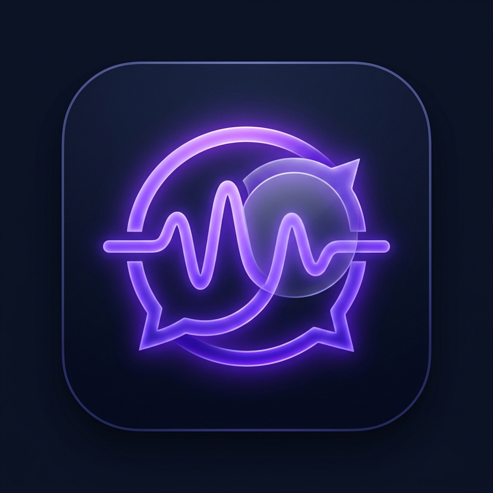

# 🎙️ TransLive – AI Realtime Audio Translator (100% Offline Android App)

<p align="center">
  
</p>

[](https://github.com/Dohuycuong24050069/Audio-device-translation-/releases/latest)
[](https://developer.android.com)
[](https://alphacephei.com/vosk/)

A high-performance Android application for **Real-Time Internal Device Audio Translation** featuring an interactive **Floating Overlay Subtitle Window** that renders over any application (YouTube, TikTok, Netflix, Games, Reels, etc.).

Powered by **Vosk Offline Speech-to-Text (STT)** and **Google Neural & ML Kit Translation** — **100% Free Forever, No Ambient Noise, Pure Internal Audio**.

> 📥 **Direct APK Download**: **[TransLive_v1.0.4.apk (v1.0.4)](https://github.com/Dohuycuong24050069/Audio-device-translation-/releases/latest)** (~144 MB, Ready to install on Android).

---

## ✨ Key Features

### 1. 🧠 High-Accuracy Speech Recognition & Neural Translation
- **Vosk AI STT (50ms Low-Latency)**: Bundles the `vosk-model-small-en-us-0.15` model directly inside Android assets. Samples audio at 16 kHz Mono PCM using an optimized 800-sample buffer with 0ms Garbage Collection pause.
- **Enhanced Neural Translation**: Integrates Google Neural Translation Engine for natural, fluent, and highly accurate Vietnamese phrasing, with Google ML Kit On-Device translation as offline fallback when disconnected.
- **Auto-Formatting & Debounce**: Intelligently capitalizes clauses and formats partial transcripts for maximum translation accuracy.

### 2. 🔊 100% Pure Internal Device Audio Capture (Android 10+)
- **Internal Audio Only**: Exclusively utilizes `AudioPlaybackCaptureConfiguration` with `MediaProjection` to capture clean internal audio from YouTube, TikTok, podcasts, Netflix, and games.
- **Zero Background/Mic Noise**: Completely bypasses the microphone, ensuring 100% clean sound from media without ambient interference or echo.

### 3. 🪟 Interactive Floating Overlay Widget
- **Dual Subtitle Display**:
  - **Top Row**: Real-time speech transcript from internal audio/mic.
  - **Bottom Row**: Instant Vietnamese translation.
- **Dynamic Resizing**:
  - **Cycle Presets (`⤢`)**: Toggle between Compact (270dp), Standard (340dp), and Full-width mode with automatic font scaling.
  - **Freeform Corner Drag (`viewResizeCorner`)**: Drag the bottom-right handle to adjust overlay width smoothly.
- **Minimization & Floating Bubble (`—`)**:
  - Tap `—` to collapse into a floating circular bubble.
  - Smooth dragging and tap-to-restore (<350ms click detection).
- **Fast Language Swap (`⇄`)**: Invert translation direction on the fly.
- **Touch-Conflict-Free Controls**: Control buttons have isolated touch targets with ripple effects, preventing accidental window dragging when pressing buttons.
- **Single-Instance Enforcement**: Strict lifecycle management preventing duplicate overlay windows.

---

## 📂 Project Structure

```
Audio-device-translation-/
├── android-app/                          # Native Android Project (Kotlin + Gradle)
│   ├── app/
│   │   ├── src/main/
│   │   │   ├── assets/
│   │   │   │   └── model-en-us/          # Offline Vosk Acoustic & Language Model
│   │   │   ├── java/com/realtimetranslator/
│   │   │   │   ├── MainActivity.kt       # Permissions, Source toggle & Service launcher
│   │   │   │   ├── AudioCaptureService.kt# 50ms Vosk PCM loop & Internal Audio capture
│   │   │   │   ├── FloatingOverlayService.kt # WindowManager overlay & bubble controller
│   │   │   │   └── TranslationEngine.kt  # Google ML Kit on-device translation client
│   │   │   ├── res/                      # Layouts (floating card, bubble) and drawables
│   │   │   └── AndroidManifest.xml       # Foreground Service types (mediaProjection, mic)
│   │   └── build.gradle.kts              # Vosk AAR, JNA, ML Kit & Android 14 configuration
│   └── gradle/wrapper/                   # Gradle 8.4 wrapper
│
├── web-simulator/                        # Browser-based Interactive Prototype
│   ├── index.html                        # Virtual device viewport & draggable subtitle widget
│   ├── style.css                         # Dark glassmorphism aesthetics
│   ├── app.js                            # Web Speech API & simulator logic
│   └── server.ps1                        # Lightweight local preview HTTP server
│
├── LiveAudioTranslator_Vosk_Offline.apk  # Prebuilt APK ready to install
└── README.md
```

---

## 🛠️ Technology Stack

| Component | Technology | Description |
|---|---|---|
| **Language** | Kotlin 1.9+, Java 17 | Type-safe native Android implementation |
| **Speech-to-Text** | `com.alphacephei:vosk-android:0.3.75` | Kaldi-based offline speech recognition |
| **Native Bindings** | `net.java.dev.jna:jna:5.13.0` | C/C++ native runtime bridging for Vosk |
| **Translation Engine** | Google ML Kit Translate (On-Device) | Local neural machine translation model |
| **Audio Capture** | `AudioPlaybackCapture` (Android 10+) | Low-level internal PCM stream interception |
| **Window System** | Android `WindowManager` | System-level floating overlay & draggable bubble |
| **Architecture** | Android Foreground Services + Coroutines | Non-blocking streaming I/O with background persistence |

---

## 🚀 Getting Started

### Prerequisites
- Android Studio Hedgehog (2023.1.1) or newer
- JDK 17
- Android SDK 34 (Android 14)
- Physical device or emulator running **Android 10 (API 29)** or higher for internal device audio capture (Microphone mode works from Android 7.0+).

### Building from Source

1. **Clone the Repository**:
   ```bash
   git clone https://github.com/Dohuycuong24050069/Audio-device-translation-.git
   cd Audio-device-translation-/android-app
   ```

2. **Assemble Debug APK**:
   ```bash
   ./gradlew assembleDebug
   ```
   The generated APK will be located at:
   `app/build/outputs/apk/debug/app-debug.apk`

3. **Install via ADB**:
   ```bash
   adb install -r app/build/outputs/apk/debug/app-debug.apk
   ```

---

## 📱 How to Use

1. **Install and Launch** the app on your Android device.
2. Grant the required permissions when prompted:
   - **Display over other apps** (`SYSTEM_ALERT_WINDOW`): Required to show the floating subtitle window.
   - **Microphone**: Required for audio recording.
   - **Screen / Audio capture**: Required on Android 10+ to intercept internal system audio.
3. Tap **"▶ Bắt đầu dịch" (Start Translation)**.
4. The floating subtitle window will appear. Switch to **YouTube, TikTok, Netflix, or any game**:
   - Spoken English audio is transcribed and translated to Vietnamese in real-time right above your active app!
5. **Overlay Controls**:
   - **Drag header**: Reposition anywhere on screen.
   - **`⇄`**: Swap source/target languages.
   - **`⤢`**: Switch window size (Compact / Standard / Full).
   - **Bottom-right corner**: Drag to freely resize width.
   - **`—`**: Minimize to a compact floating bubble.
   - **`✕`**: Completely stop all translation and background services.

---

## 🔒 Privacy & Permissions

- **100% On-Device Processing**: No voice data, audio streams, or transcribed text are ever transmitted to any external server.
- **Required Permissions**:
  - `RECORD_AUDIO`: Required for capturing device sound / microphone.
  - `FOREGROUND_SERVICE` & `FOREGROUND_SERVICE_MEDIA_PROJECTION`: Required by Android 14+ for background audio capture.
  - `SYSTEM_ALERT_WINDOW`: Required for rendering the floating subtitle widget over other apps.

---

## 📄 License

This project is licensed under the MIT License — feel free to use, modify, and distribute.
